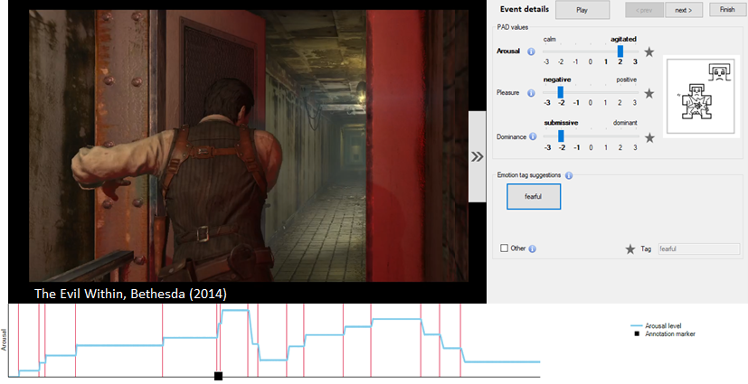

# AffectRankTrace

A tool for affect annotation, combining RankTrace (Lopes et al. 2017) and Self-Assessment Manikins (SAM) (Bradley and Lang 1994) methods.

## Overview

AffectRankTrace is an annotation tool that enables continuous, unbounded annotation of one affective dimension in real time, and discrete annotation of the three PAD dimensions. Continuous annotation, similar to RankTrace, allows users to control a curve in real time to assess the intensity of one emotional dimension. Discrete annotation is facilitated via a digitalized version of a 7-point scale Self-Assessment Manikin (SAM). The pleasure, arousal, and dominance scales are designed as slider controls ranging from -3 to 3, with brief descriptions of each dimension available through tooltips. Adjusting the slider values generates a SAM figure, displayed on the right. Additionally, when slider values are changed, categorical emotion words, based on the theory (Russell et al. 1977), are suggested to describe the corresponding PAD value combination. Users can select one of the suggestions if it is relevant or input their own description.

### Manipulation
During video play, users perform continuous annotation by long-pressing, for a subjective duration, one of the dedicated keys to either raise or lower the curve line. When the key is released, a red line appears to mark the annotation event (see Figure below). When no key is pressed, the curve line continues straight at the last level set after the key was released. At the end of the recording, continuous annotation is terminated and the tool enables navigation between the annotation events (red lines) to assess arousal, pleasure, and dominance using SAM. Users can freely browse the marked events using "previous" and "next" buttons, skipping irrelevant ones. They can also replay 10 seconds of the recording around each event (5 seconds before and after) for reference. The "finish" button becomes enabled at the final event, allowing users to end the annotation process.

<p align="center">
  
</p>

*Figure. Overview of AffectRankTrace interface. The tool was used to load a playback video of palyers' own play session of a sequence of the game "The Evil within" (Bethesda, 2014) and collect data on their affective experience. Players' continuous annotation of Arousal is displayed as a graph beneath the video canvas. The annotation events (red lines) mark moments of increased and decreased arousal. At the end of arousal annotation, the players could navigate through these events to report discrete values for arousal, pleasure, and dominance using corresponding sliders. Adjusting the slider values generates a SAM figure.*

## Requirements

- Windows 10/11
- Microsoft .NET Framework 4.8
- Visual Studio 2022 (or later) with .NET desktop development workload
- VLC media player (required for video playback)

## Dependencies

All required dependencies, including the LibVLC native runtime, are managed through NuGet. Running a package restore (performed automatically by Visual Studio or `nuget restore`) is sufficient before building the solution.

## Installation

1. Clone the repository.
2. Open `AffectRankTrace.sln` in Visual Studio.
3. Restore the NuGet packages (this is performed automatically by default).
4. Build and run the solution.

## Data Storage

The application generates two .csv files stored in a dedicated subdirectory located in the solution root directory `<SolutionRoot>/Annotation_data/`. The solution root is determined automatically from the executable location.

```
<SolutionRoot>/Annotation_data/
├── realtime_data.csv	# Continuous annotation data.
└── discrete_data.csv	# Discrete annotation data.
```

### Data structure


## Citation

If you use this software in your research, please cite:

```bibtex
@inproceedings{graja2024affectranktrace,
  title={AffectRankTrace: a tool for continuous and discrete affective annotation during extended usability trials},
  author={Graja, Sarra and Lovell, P George and Scott-Brown, Ken},
  booktitle={2024 12th International Conference on Affective Computing and Intelligent Interaction (ACII)},
  pages={19--26},
  year={2024},
  organization={IEEE}
}
```
